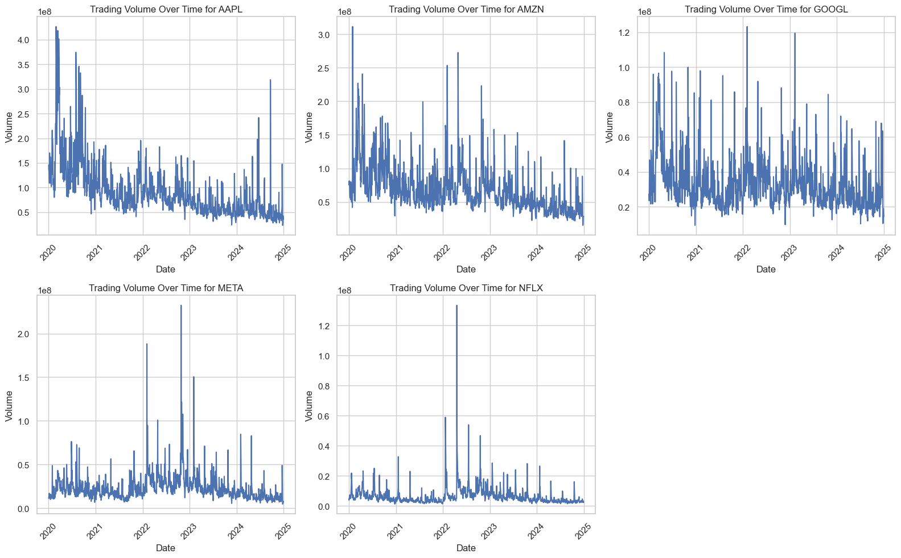
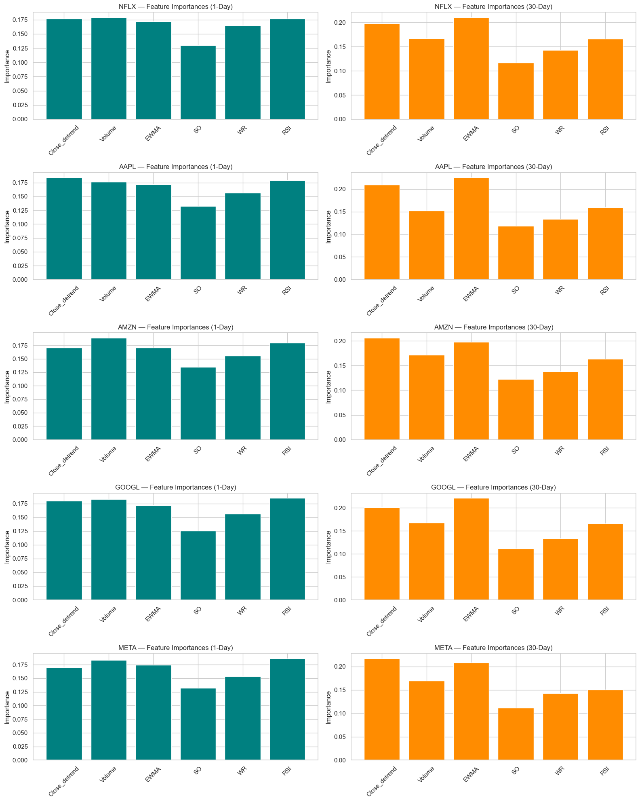
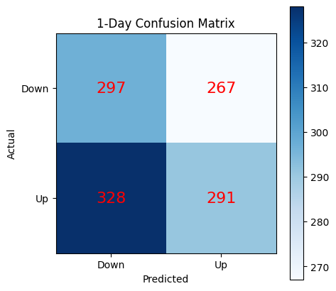
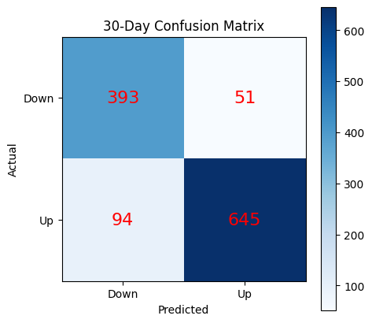

### Stock Market Prediction Model

**Sritha Kondragunta**

#### Executive summary
This project explores machine learning approaches for predicting stock price movements of FAANG companies (AAPL, AMZN, GOOGL, META, NFLX). We begin with a Random Forest baseline, using engineered technical indicators (RSI, OBV, detrended price), and then extend to a deep learning approach (LSTM with stock embeddings) to capture temporal dependencies and stock-specific patterns.

Our models aim to classify whether a stock will move up or down over short-term (1-day) and medium-term (30-day) horizons. Results show that while tree-based methods provide solid baselines, LSTM models with embeddings significantly improve generalization and interpretability.

### Problem Statement
The goal of this project is to predict stock price movements (up or down) using historical data and company embeddings. The challenge lies in the noisy and non-stationary nature of stock market data. By leveraging both traditional machine learning (Random Forest) and deep learning approaches (LSTM with stock embeddings), we aim to improve predictive accuracy such that it can assist investors and analysts to identify short-term opportunities.

#### Research Question
Can we accurately classify and predict stock price direction (up or down) of FAANG stocks using historical financial and economic data?

### Rationale
Stock market forecasting is notoriously difficult, but even small improvements in classification accuracy can provide a significant edge in financial trading and risk management. By identifying which technical indicators are most predictive, this project adds transparency to the modeling process and explores whether models trained on one stock can generalize to others.

#### Model Outcomes
- Learning type: Classification (binary: stock goes up vs. down).
- Supervised Learning: Labels are generated based on stock returns (1 if next-day return > 0, else 0).
- Expected Output: Probability of stock price increasing.

#### Modeling
- Random Forests provide interpretability through feature importance.
- LSTMs capture sequential dependencies in price movements.

### Data Sources/Acquistion
All historical stock data was retrieved directly from Yahoo Finance using the open-source Python library yfinance. The dataset includes daily Open, High, Low, Close, and Volume (OHLCV) data for FAANG companies from January of 2020 to December of 2024. 

#### Methodology
What methods are you using to answer the question?

1. Data Preparation:
    - Load and clean data (remove NaNs, filter per stock).
    - compute technical indicators (RSI, PROC, SO, WR, OBV, EWMA, Close_detrend)
    - Engineer target labels for 1-day and 30-day classification.
2. Model Training:
    - Random Forest Classifier (baseline)
    - LSTM with Stock Embeddings (deep learning)
3. Evaluation:
    - Accuracy is used to assess performance.
    - Compare stock-specific vs. general models.
    - Perform cross-stock testing to evaluate generalization.
4. Feature Importance Analysis:
    - Metrics: Accuracy, Precision, Recall, F1.
    - Analysis: Per-stock accuracy, generalization across stocks, feature importances (Random Forest).

#### Model Evaluation

For both the baseline Random Forest Model and Long Short Term Memory Model there are two types of models: individual models trained per stock and a full market model trained on all available data.

**Random Forest**:

NFLX:
- 1-day prediction accuracy: 0.4938
- 30-day prediction accuracy: 0.6831

AAPL:
- 1-day prediction accuracy: 0.5432
- 30-day prediction accuracy: 0.6337

AMZN:
- 1-day prediction accuracy: 0.5267
- 30-day prediction accuracy: 0.6379

GOOGL:
- 1-day prediction accuracy: 0.4979
- 30-day prediction accuracy: 0.6667

META:
- 1-day prediction accuracy: 0.4938
- 30-day prediction accuracy: 0.6584

Full market model accuracy:
- 1-day prediction accuracy: 48.97%
- 30-day prediction accuracy: 68.67%

From the models we also plotted feature importance:

**LSTM**:

NFLX:
- 1-day prediction accuracy: 46.89%
- 30-day prediction accuracy: 84.02%

AAPL:
- 1-day prediction accuracy: 51.44%
- 30-day prediction accuracy: 85.95%

AMZN:
- 1-day prediction accuracy: 47.58%
- 30-day prediction accuracy: 90.00%

GOOGL:
- 1-day prediction accuracy: 51.29%
- 30-day prediction accuracy: 88.43%

META:
- 1-day prediction accuracy: 51.60%
- 30-day prediction accuracy: 90.00%

Full market model accuracy:
- 1-day prediction accuracy: 49.70%
- 30-day prediction accuracy: 87.74%

1-Day Confusion Matrix:

30-Day Confusion Matrix:

These results highlight two key insights. First, both models struggle with 1-day predictions, hovering around chance-level accuracy, which suggests that short-term price movements are highly noisy and difficult to capture. Second, performance improves substantially for 30-day horizons, with the LSTM showing a clear advantage over the Random Forest. The LSTM consistently achieves stronger long-term predictive power across all stocks and in the overall market model, indicating that sequential modeling of temporal dependencies provides meaningful benefits when forecasting medium-term stock trends.

### Next Steps 
- Enhance Feature Engineering: Incorporate additional financial indicators (e.g., MACD, Bollinger Bands) and external data (e.g., news sentiment, macroeconomic indicators).

- Expand Time Horizons: Evaluate performance across multiple horizons (e.g., 7-day, 60-day) to better capture short- vs. long-term trends.